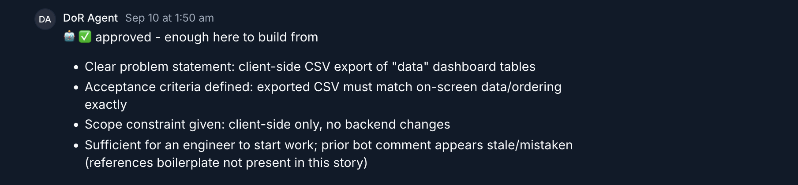
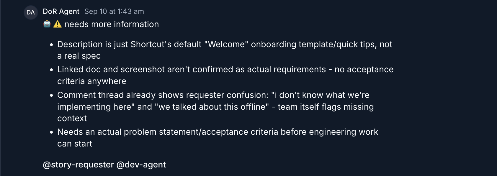

# 🦾 agents-of-ops

Agentic product ops, by product people who build agents. This repo is a working demo
of non-proprietary agents — not a maintained tool.

## Definition of Ready (DoR) Agent

**The problem:** a story that reaches "To Do" without enough to build from - maybe no
acceptance criteria or problem statement - stalls out. That's especially costly for
offshore devs and other agents picking up work asynchronously: there's no synchronous
handoff to just ask someone in the same timezone, so a gap that would cost minutes in
person risks a full day of waiting.

**What it does:** a run-to-completion, episodic agent audits each story in "To Do"
against Shortcut's API - description, comments, linked Google Docs, the parent epic if
needed - and posts a verdict straight back to the card: a label, plus the reasoning
behind it. Nothing carries over between stories or between runs; everything the next
person (or agent) needs is already sitting on the card.

**See it in action** - two real verdicts, posted by the agent:



*Approved quietly - no mention, nothing further needed from anyone.*



*Needs more info - notifies the requester directly, since this one's a call to action.*

**Built on:** the [Shortcut](https://shortcut.com) API for stories, epics, labels and
comments, plus the Google Drive API (read-only) for stories whose real spec lives in a
linked Google Doc rather than the card itself.

## Design highlights

- **Explainable** - every verdict carries a stated reason, posted where the team already looks.
- **Portable, for cost control** - swapping models is a one-line change; per-model
  quirks are isolated so a swap never breaks the agent logic.
- **Token-frugal by design** - tools are weighted by cost and impact, so the agent only
  reaches for an expensive one once a cheaper one has failed to answer the question.

The notebook ([`dor_agent.ipynb`](dor_agent.ipynb)) goes deeper into design decisions - why state lives
on the Shortcut card instead of a database, the trade-offs that comes with, and the
reasoning behind each design decision in the agent loop.

## Running it

Requires:
- `SHORTCUT_TOKEN` - a read-and-comment token for the agent's Shortcut account
- `ANTHROPIC_API_KEY` - for the Claude model running the audits
- `GOOGLE_SERVICE_ACCOUNT_KEY.json` - a Drive-readonly service account key, only needed
  if stories link out to Google Docs

```
pip install anthropic requests arrow google-api-python-client google-auth pypdf python-docx
```

Then, in the notebook: `run_audit()` audits every story in a target workflow state
(defaults to "To Do") that hasn't already been reviewed since it last changed.
